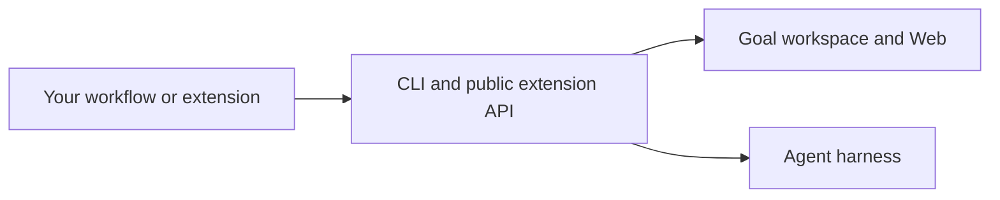

<p align="center"><a href="https://github.com/game-dev-rta-club/chill-agent-cli/actions"></a>  </p>

# chill-agent-cli

Local workspace infrastructure for developers building agent workflows. Use its CLI, Web interface, and harness connection independently of the chill-agent skills and continuation policy.

For the ready-to-use experience, start with [chill-agent](https://github.com/game-dev-rta-club/chill-agnet).

## Responsibilities

| This package owns | The integrating application owns |
| --- | --- |
| Goal hierarchy, Brief versions, Conversation, and Letters | How the agent plans and carries out work |
| Local Web interface and feedback delivery | Skills and user onboarding |
| Harness observations, queue coordination, and pause state | When to request more work |
| Runtime preparation and extension hosting | Continuation policy and its configuration |



The standalone distribution does not bundle an automatic continuation policy or its Web control.

## Standalone quickstart

Requires **Node.js 24** and Git. The current Desktop harness connection supports **Codex Desktop on macOS**. Portable JavaScript contracts are also tested on Windows; this does not imply Windows Desktop integration.

```sh
git clone https://github.com/game-dev-rta-club/chill-agent-cli.git
cd chill-agent-cli
npm ci
npm run web:build
node bin/chill-entry.mjs goal create --title "My next project"
node server.mjs --local
```

The foreground server prints the local Web URL. Goal data and runtime snapshots are separate from the repository checkout.

## Command reference

Use the installed version's help for supported commands, flags, and examples:

```sh
node bin/chill-entry.mjs --help
node bin/chill-entry.mjs goal --help
node bin/chill-entry.mjs setup --help
node bin/chill-entry.mjs server --help
```

To prepare a stable runtime and the macOS Desktop hook for a project:

```sh
node bin/chill-entry.mjs setup prepare --project /path/to/your/project
```

Continue with the stable command prefix returned by setup. Updating a source checkout does not replace a running runtime snapshot.

## Integrating an execution policy

Use the public [extension API](docs/extensions.md) for workspace observations, execution eligibility, and coordinated enqueueing. The integrating application supplies the policy; the host owns delivery and execution coordination.

Import public package entry points, rather than private library files or on-disk storage. See the extension reference for the protocol, lifecycle, and Web controls. The `./runtime` export supports packaging the CLI into a composed runtime.

## Development and maintenance

```sh
npm ci
npm run check
```

[Contributing](CONTRIBUTING.md) covers local development and pull requests. [Releasing](RELEASING.md) covers versioning and distribution. Report vulnerabilities through [Security](SECURITY.md).

CLI behavior, command documentation, and integration contracts belong in this repository. Consumer projects should link here instead of copying these details.

[MIT license](LICENSE). Experimental software; back up important workspace data.
