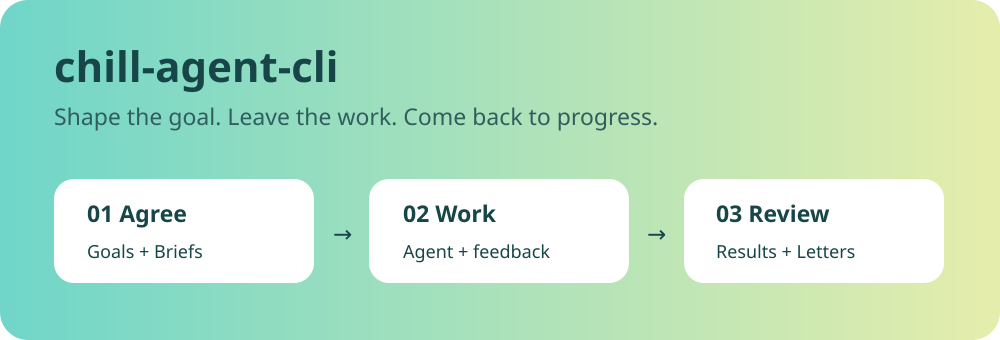
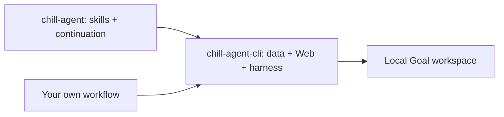

<p align="center"></p>

<p align="center"><a href="https://github.com/game-dev-rta-club/chill-agent-cli/actions"></a>  </p>

# The shared workspace, without an execution policy

Use the Goal CLI, local Web interface and agent connection independently. Bring your own schedule or orchestration. No automatic continuation is enabled or bundled.

| Make the work visible | Keep the conversation together | Stay in control |
| --- | --- | --- |
| Nested Goals and readable Briefs | Annotate results; answer Letters | Native queue, Pause and Resume |

## Try it

**Current integration: Codex Desktop on macOS, Node.js 24.** Core data commands are
portable; other Desktop harnesses are not connected yet. Messaging and remote
access are optional and off by default.

```sh
git clone https://github.com/game-dev-rta-club/chill-agent-cli.git
cd chill-agent-cli
npm ci
npm run web:build
node bin/chill-entry.mjs goal create --title "My next project"
node server.mjs --local
```

The foreground command prints the local Web URL. `goal --help` lists the data operations. For the macOS Desktop hook and a persistent runtime, use `setup prepare --project <path>`.

## Two packages, one workspace



- [chill-agent](https://github.com/game-dev-rta-club/chill-agnet) composes the complete experience.
- [chill-agent-cli](https://github.com/game-dev-rta-club/chill-agent-cli) exposes the foundation and a versioned extension contract.
- The complete package pins one tested CLI release. No separate global CLI is required.
- Repository updates do not move your Goal data. Runtime snapshots preserve the running version until restart.

## How it feels

1. Describe an outcome and agree on the scope.
2. Read the current Brief; leave comments on the parts that matter.
3. Let the agent work. Answer a Letter when a decision needs you.
4. Review the result. Keep going, refine it, or mark the Goal done.

The CLI owns storage, delivery and execution observations. Extensions own policy. A CLI-only server has no 24h control.

## Develop and contribute

```sh
npm ci
npm run check
```

Small fixes can go straight to a pull request. Discuss behavior and protocol changes
in an issue first. See [Contributing](CONTRIBUTING.md), [Releases](RELEASING.md),
[Security](SECURITY.md) and the [MIT license](LICENSE).

This is experimental software. Keep backups of important workspaces.
